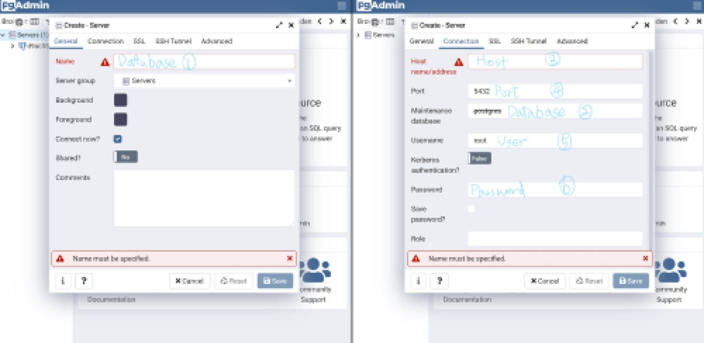

# About this.
- docker + django + redis + celery + postgres + pgAdmin + jupyterlab + pytorch_cpu + selenium + chromedriver
- 컴포즈 빌드에 성공한 skelecton django app 

# pgAdmin 4

# git 작업과정
1. 한 조직의 owner로부터 **organization**조직에서 하는 **project** 중 하나인 django-docker 프로젝트에 제3자인 내가 **collaborate**협업을  권유받게 되었다.
2. Team 장이 내게 참여권유 결정하는 메일을 보내고 나는 수락하여 나는 **collaborator**의 지위를 얻었다.
3. 얼마 지나지 않아 더욱 적극적인 기여를 하라는 의미로 collaborator보다 높은 (write)권한을 가지는 **member**로 **join**합류를 권하는 메일을 보내왔고 나는 수락했다.
4. django-docker 프로젝트에 조직의 member로 참여하게 되었으므로 그 프로젝트를 내 원격저장소인 깃헙에 **Fork**해왔다(저장소 메인화면 우상단에 포크단추를 클릭했다). 이로써 *깃히스토리가 연결이 된 상태로* 내 원격저장소인 github에 복제하게 된 것이다.
5. 실제로 작업을 하기 위해 git이 설치된 내 로컬머신에 **git bash를 이용해** 복제**clone**를 했다. git init을 하지 않은 상태의 폴더이므로 아직은 git repository가 아니기 때문에 git pull로 가져올 수 없다. 이때는 git clone을 해야 한다.
    - git clone <원격저장소주소>
    - 이로써 원격저장소의 project이름과 동일한 이름으로 프로젝트폴더django-docker가 만들어 진다. 
    - cd django-docker로 들어가든가 바로 우클릭하여 vscode로 들어가든가 하여 작업을 시작할 수 있다.
6. django-docker 폴더 안으로 들어가면 이제부터는 git이 버전관리를 하게 해야 하므로 
    - git init

# project 로컬화하기
1. 파이썬의 경우 가상환경을 맞게 생성한다.
2. .env 등의 환경변수와 같이 .gitignore로 제외된 파일이나 설정을 로컬머신에 맞게 설정한다.
3. 도커의 경우 컨테이너를 재생산한다.

# 기여작업을 push하기 전까지 하게 되는 git 프로세스
1. 원본훼손을 방지하며 기여작업(예: 새 기능 구현)으로 변경되는 사항을 추적하기 위해 격리된 **branch**를 만든다.
    - 기존: git checkout -b [브랜치 이름]
    - 새방식:   
        git switch --create [브랜치 이름]  
        git branch [브랜치 이름]
    - 브랜치 확인: git branch (또는 git branch --list)  

2. Create index to stage the changes for commit즉 커밋하려는 파일들 인덱스를 만든다. : `git add .`  
    - 이 액션은 브랜치와 무관하게 이루어 진다.

3. 잘못 변경된 사항을 복원할 때도 있다.
    - 기존: 
    - 새방식:
        - To unstage for commit(restore the index): git restore --staged <file>  

4. 커밋하여 변경사항에 관한 스냅샷을 찍는다. 이러면 히스토리가 기록되는 것이다.
    - 이 액션은 브랜치 종속적으로 이루어 진다.
    - git commit -m "first commit"

# 커밋이 이루어진 변경사항을 원격 저장소에 push하기
0. 내가 기여하는 프로젝트는 두 군데의 원격저장소와 연결되어 있는 상태이다. 하나는 organization에 있고 다른 하나는 나의 github저장소에 있다. 이 둘에는 각각 upstream과 origin 으로 관용적으로 부른다.  
1. git clone으로 로컬에 복사하였기 때문에 origin과의 연결만 존재하고 upstream과 아무런 연결고리가 없는 상태이다. git remote -v로 확인할 수 있다.  upstream의 변경사항에 대해 추적하기 위해 pull할 수 있도록 upstream에 연결할 수 있다.  
    
    - git remote add upstream <조직의 프로젝트 저장소 주소>  
    - git remote add origin <나의 프로젝트 저장소 주소>

2. 우선 로컬 data브랜치로(이미 커밋할 때부터 data브랜치였다.) origin/data브랜치에 push해두자.
    - git push origin data
    